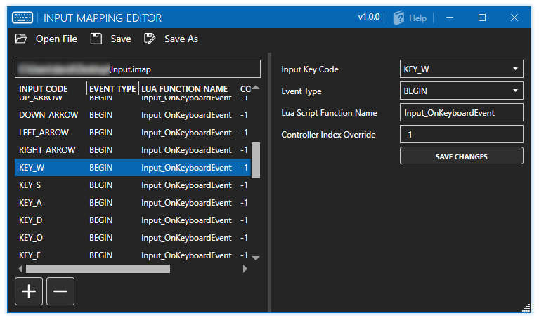

# IMAP-Editor

  

**Releases are now being put out! You can get them [HERE](https://github.com/Telltale-Modding-Group/IMAP-Editor/releases)!**
**If you need help or have questions about the application, click [HERE](https://github.com/Telltale-Modding-Group/IMAP-Editor/wiki)!**

## About
**This application is designed to edit .imap files that exist within a Telltale game.**

***.imap = Input Mappings***

**.imap** files are responsible for most of the input that you have in a Telltale game, with the editor you'll be able to modify and change/rebind key bindings to whatever you like. You can also add or remove imap entries and add in your own custom lua function names. **Credit to Lucas for the super handy [LibTelltale](https://github.com/LucasSaragosa/LibTelltale) library!**

## INSTALLATION (REQUIRED)

1. Download the latest app from the **[releases tab]((https://github.com/Telltale-Modding-Group/IMAP-Editor/releases))**.
2. Download and install the **[Windows 10 SDK](https://developer.microsoft.com/en-us/windows/downloads/windows-10-sdk/)**.

## Supported Games
The imap editor uses [LibTelltale v3.0.0](https://github.com/LucasSaragosa/LibTelltale), as of that version it currently supports the following games (not all have been tested)

***
- The_Walking_Dead_Definitive_Series
- The_Walking_Dead_Season_Four
- The_Walking_Dead_Season_Three
- The_Walking_Dead_Michonne
- The_Walking_Dead_Season_Two
- The_Walking_Dead_Season_One
- Game_Of_Thrones
- The_Wolf_Among_Us
- Marvels_Gaurdians_Of_The_Galaxy
- Batman_The_Telltale_Series
- Batman_The_Enemy_Within
- Tales_from_The_Borderlands
- Telltale_Texas_Holdem
- Bone_Out_from_Boneville
- Bone_The_Great_Cow_Race
- CSI_3_Dimensions_of_Murder
- CSI_Deadly_Intent
- CSI_Fatal_Conspiracy
- CSI_Hard_Evidence
- Jurassic_Park_The_Game
- Law_and_Order_Legacies
- Minecraft_Story_Mode_Season_One
- Minecraft_Story_Mode_Season_Two
- Poker_Night_at_The_Inventory
- Poker_Night_2
- Sam_and_Max_Season_One
- Sam_and_Max_Season_Two
- Sam_and_Max_Season_Three
- Sam_and_Max_Save_The_World_Remastered
- Hector_Badge_Of_Carnage
- Puzzle_Agent
- Back_To_The_Future
- Strong_Bad_Cool_Game_for_Attractive_People
- Tales_of_Monkey_Island
- Wallace_And_Gromits_Grand_Adventures
***
